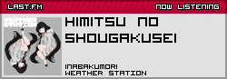
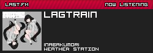
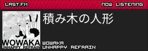
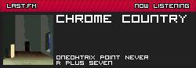
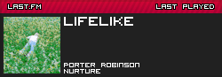
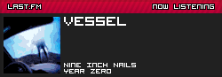

# np
[last.fm](https://last.fm/)-powered forum signature nanoservice

## usage
requires [poetry](https://python-poetry.org/docs/) dependency management tool, but proficient users can also get required packages their own way by reading the pyproject file. also requires python 3.12 or above.

clone the repository, go into the folder, copy the `env.example.py` file to `env.py`, get yourself a [last.fm api key](https://www.last.fm/api/authentication) and edit the values in your new file with the ones you need. then execute:
```
poetry install
poetry run python start.py
```
*np* will start serving on the port written in the `env.py` file. you can reverse-proxy it however desired from here. if it's possible, try setting caching to no more than 60 seconds for your domain if you're using cloudflare or something similar.

### endpoints
- `/` -- serves the currently cached image near-instantly
- `/?force` or `/?force=1` -- requests an update+cache, bypassing delay. takes a few seconds to update this way, usually. only use this for testing.
- `/plain` -- directly queries the API and returns results as simplified json. takes a second or two

## showcase




### quantized covers



